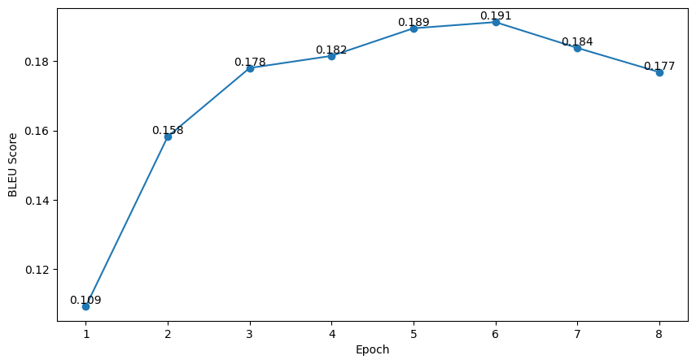

# Transformer-ReImplementation
[DMIS](https://dmis.korea.ac.kr/) 연구실에서 진행한 Transformer 모델 재구현 프로젝트입니다. ([Attention is All You Need (2017)](https://proceedings.neurips.cc/paper_files/paper/2017/hash/3f5ee243547dee91fbd053c1c4a845aa-Abstract.html))

## Usage
### Train
```bash
python main.py --mode train
```
```bash
python main.py --mode train --checkpoint ./checkpoints/model_5.pt --run_name from_epoch_5 --data_path ./data --tokenizer_path ./tokenizer --lr 1e-4
```
### Evaluate
```bash
python main.py --mode eval
```
### Inference
```bash
python main.py --mode test
```
### Optional Arguments
|Argument|Default|Description|
|:-|:-|-:|
|--checkpoint|None|Checkpoint path|
|--tokenizer_path|None|Path of pretrained tokenizer|
|--data_path|./data|Data path of train/val/test|
|--output_path|./output|Output path (for inference)|
|--batch_size|32|batch size|
|--num_epochs|10|number of epochs|
|--device|cuda|Device type (cpu or cuda)|
|--lr|1e-4|Learning rate|
|--run_name|From scratch|WandB Run name|

## Dataset
IWSLT2017 en-de 데이터셋 (https://huggingface.co/datasets/iwslt2017)

## Environment
NVIDIA GeForce RTX 3060 (12GB VRAM)

## Settings
학습에 사용한 하이퍼파라미터는 다음과 같습니다.


|Name|Value|
|:-|-:|
|Epochs|8|
|Batch size|32|
|Learning rate|1e-4|
|Dropout|0.1|

## Result
Validation BLEU score는 아래와 같습니다.



BLEU가 가장 높은 체크포인트를 대상으로 Test를 진행하였으며, 결과는 아래와 같습니다.

|Model|BLEU|
|:-|-:|
|Transformer(Base, Paper)|27.3|
|Transformer(Ours)|20.1|

## References
원 논문 이외에 아래 레퍼런스를 추가로 참고하여 구현하였습니다.
- [Transformer (Attention Is All You Need) 구현하기](https://paul-hyun.github.io/transformer-01/)
- [Transformer를 이해하고 구현해보자!](https://kaya-dev.tistory.com/8)
